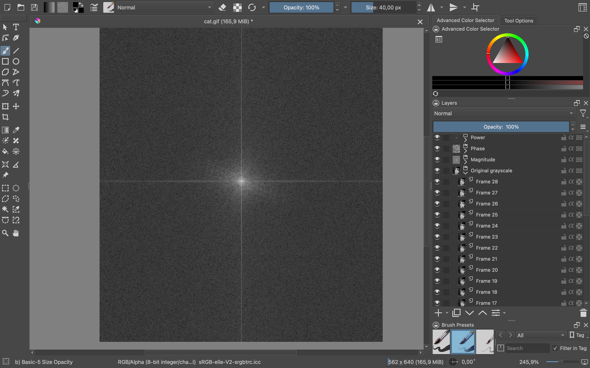

# 2D: Aplikace a zobrazení 3D Fourierovy transformace pro soubory formátu GIF

Semestrální práce je na téma aplikace a zobrazení 3D Fourierovy transformace pro soubory ve formátu GIF.
Počítá amplitudové, fázové a power spektrum.

## Uživatelská dokumentace

Plugin je napsaný v jazyce Python a je určený pro aplikaci Krita. 

### Použití:

1. Vložte soubory pluginu do složky pro pluginy s názvem pykrita v aplikaci Krita.
2. Restartujte aplikaci Krita a v Python Plugin Manageru zaškrtněte plugin s názvem "fft".
3. Otevřete menu Nástroje > Skripty > FFT GIF.
4. Vybere si GIF soubor, který chcete nahrát. Nejlépe volte GIF soubory s nižším počtem snímků pro kratší dobu zpracovávání pluginem.
5. Plugin načte jednotlivé snímky GIFu, provede na každém snímku 2D Fourierovu transformaci a zobrazí výsledky (amplitudové, fázové a power spektrum) jako vrstvy v dokumentu Krita. 
6. Po dokončení můžete zvolit, jestli chcete uložit výsledky jako samostatné GIFy pro každé spektrum.

## Teoretická dokumentace

Fourierova transformace je matematický postup umožňující rozložit signál na jednotlivé frekvence. 
V mém případě pracuji s 3D FT, kdy zpracovávám snímky GIFu pomocí 2D FT a jako 3. rozměr uvažuji všechny snímky GIFu jdoucí za sebou.

FT rozdělí obraz na různé složky frekvencí:

- **Amplitudové spektrum**: 
  - Ukazuje, jaké frekvence v obraze převažují. To znamená, jestli v obraze převažují spíše detaily (vysoké frekvence) anebo spíše větší jednotvárné plohy (nízké frekvence). 
  - Hodnoty amplitud jsou na snímku umístěny tak, že nízké frekvence se nacházejí uprostřed a vysoké frekvence jsou uložené směrem ke krajům. 
  - Tato složka je užitečná například při analýze textur nebo identifikaci opakujících se vzorů v obraze.
- **Fázové spektrum**: 
  - Zobrazuje posun jednotlivých frekvencí, tj. informace o tom, kde jsou konkrétní frekvenční složky v obraze umístěny. 
  - Okem není moc dobře čitelné, protože se jeho hodnoty pohybují mezi -π a π.
  - Podobně jako u amplitudy jsou nízkofrekvenční fáze blízko středu snímku a vysokofrekvenční směrem ke krajům.
  - Fázové spektrum je zásadní pro rekonstrukci původního signálu a to platí i u rekonstrukce obrazu. 
- **Power spektrum**: 
  - Vyjadřuje intenzitu jednotlivých frekvencí, tj. míra energie, kterou každá frekvence v obraze nese.
  - Vypadá podobně jako amplitudové spektrum, kde jsou hodnoty na obraze vůči sobě ve větším kontrastu.
  - Nejvyšší hodnoty (energie) jsou uprostřed snímku a nižší pak směrem k okrajům.

### Výpočet FT
- **fft_result = np.fft.fft2(frame)**
  - `frame`: Černobílý snímek GIFu.
  - `np.fft.fft2(frame)`: Aplikuje 2D diskrétní Fourierovu transformaci na snímek. Nízké frekvence jsou směrem ke krajům snímku a vysoké uprostřed.
- **fft_shifted = np.fft.fftshift(fft_result)**
  - `np.fft.fftshift(fft_result)`: Přeuspořádá výstup Fourierovy transformace tak, aby nízké frekvence byly uprostřed snímku a vysoké směrem ke krajům.

### Výpočet amplitudy, fáze a power spektra
- **Amplituda**:
  - `magnitude = np.log(np.abs(fft_result) + 1)`
  - `np.abs(fft_result)`: Vypočítá absolutní hodnotu (velikost) komplexních čísel ve výstupu Fourierovy transformace.
  - `np.log(... + 1)`: Aplikuje na abs. hodnoty komplexních čísel logaritmus a zlepšuje tak viditelnost nižších frekvencí ve výsledném obrazu. Přičítá se 1, abychom se vyhnuli logaritmu z 0.
- **Fáze**:
  - `phase = np.angle(fft_result)`
  - `np.angle(fft_result)`: Vypočítá úhel komplexního čísla.
- **Power**:
  - `power = magnitude ** 2`
  - `magnitude ** 2`: Vypočítá čtverec amplitudy a zvýrazní tak v obraze rozdíly mezi vyššími a nižšími frekvencemi.

### Normalizace spectra
- `255 * (data / np.max(data)).np.uint8`
- `data`: Hodnoty spektra.
- `data / np.max(data)`: Hodnoty spektra jsou poděleny jejich maximální hodnotou a dostaneme tak Hodnoty mezi 0-1.
- `255 * (...)`: Hodnoty jsou naškálovány do rozsahu 0–255.
- `... .np.uint8`: Hodnoty jsou převedeny na celá čísla.

## Programátorská dokumentace

Plugin je napsaný v jazyce Python a využívá následující knihovny:
  - `krita`: Pro práci s dokumenty a vrstvami v Krita API.
  - `numpy`: Pro numerické výpočty, FFT transformace a manipulace s daty.
  - `Pillow`: Pro práci s obrázky.
  - `PyQt5`: Pro interakci s uživatelem (dialogy, různá potvrzení, atd.).

### Průběh pluginu
**1. Aktivace pluginu**
  - Uživatel aktivuje plugin prostřednictvím menu: **Tools -> Scripts -> FFT GIF**
  - Zavolá se metoda `get_fft_gifs()`, která řídí hlavní logiku pluginu.

**2. Výběr GIF souboru**
  - Plugin vyzve uživatele k výběru GIF souboru prostřednictvím dialogového okna: "Select a GIF File"**

- **Uživatel zvolí GIF soubor:**
  - Soubor je načten a rozdělen na jednotlivé snímky (frames).
  - Každý snímek je převeden na černobílý obrázek.
  - Pokud GIF neobsahuje snímky, zobrazí se chybová hláška: "Failed to load GIF frames." a plugin se ukončí.
- **Uživatel nezvolí soubor:**
  - Zobrazí se chybová hláška: "Didn't select a GIF file"
  - Plugin se ukončí.

**3. Výpočet Fourierovy transformace**
  - Pro každý snímek GIFu se provádí následující operace:
1. **Fourierova transformace (FFT):**  
   - Na snímek se aplikuje metoda `apply_fft(frame)`, která provádí 2D FFT.  
   - Výstupem je spektrum frekvencí ve formě numpy pole.
2. **Výpočet spekter:**  
   - Metoda `get_spectrum(fft_result)` vypočítá amplitudové, fázové a power spektra.
   - Spektra jsou normalizována (`normalize_spectrum`) a převedena na černobílé obrázky (`data_to_frame`).
3. **Uložení výsledků:**  
   - Výsledná spektra jsou uložena do seznamů (`magnitude_frames`, `phase_frames`, `power_frames`) pro další zpracování.

**4. Zobrazení výsledků v Kritě**
  - Plugin zobrazí originální snímky GIFu a jejich spektra jako nové vrstvy v aktivním dokumentu Krita pomocí funkce `show_results_in_krita()`.
  - Pokud není žádný aktivní dokument, zobrazí se chyba: "No active document", spustí se čištění paměti a plugin se ukončí.
  - Vytvoří se skupiny vrstev: `Original grayscale`, `Magnitude`, `Phase`, `Power`
  - Každý snímek je jako vrstva přidán do příslušné skupiny a po ukončení pluginu se zobrazí.

**5. Uložení výsledků**
  - Po zobrazení výsledků se uživateli zobrazí dialogové okno: "Do you want to save the generated spectrum GIFs?"

- **Uživatel zvolí "Yes":**
  - Plugin vyzve k výběru cesty pro uložení výsledků.
  - Uloží tři generované GIFy:
    - **Amplitudové spektrum**
    - **Fázové spektrum**
    - **Power spektrum**
  - Pokud uživatel nezadá cestu, zobrazí se: "No path selected.", spustí se čištění paměti a plugin se ukončí.
- **Uživatel zvolí "No":**
  - Spustí se čištění paměti a plugin se ukončí.

**6. Vyčištění paměti**
Plugin po dokončení všech kroků vymaže dočasné snímky z paměti metodou `clear_all_frames()`.

## Zdroje
Pro zpracování semestrální práce byly využity následující zdroje:  
- **Prezentace z přednášek BI-PGA:** Sloužily jako teoretický základ pro pochopení Fourierovy transformace a její aplikace.  
- **Dokumentace Krita:** Poskytla základní informace o rozhraní pro vývoj pluginů, práci s vrstvami a integraci Pythonu do Krita.  
- **Dotazování ChatGPT:** Pomohlo při vysvětlování složitějších částí kódu, návrhu struktury pluginu a objasnění matematických operací spojených s Fourierovou transformací.  
